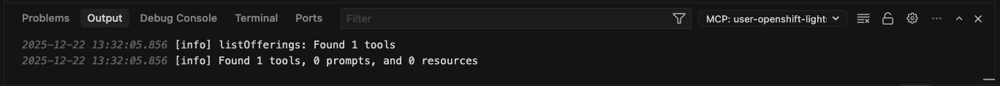
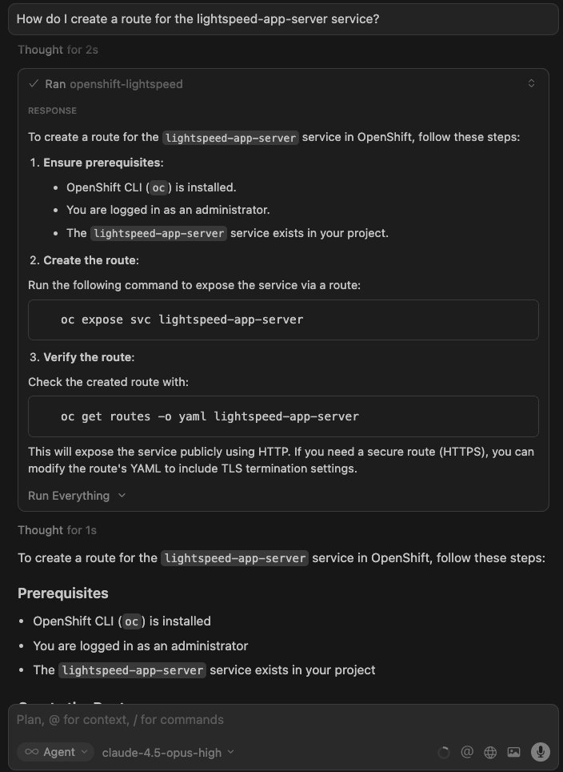
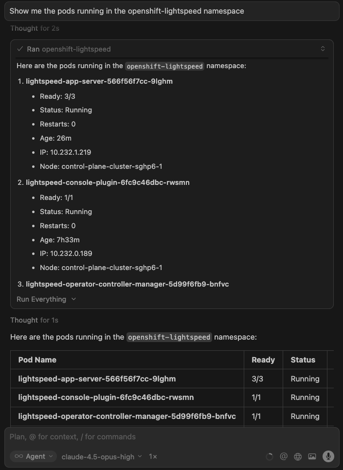

# Bringing OpenShift Expertise to Your IDE with an OpenShift Lightspeed MCP Server

Modern Integrated Development Environment (IDEs) have evolved beyond simple code editors into intelligent development environments powered by AI assistants. These assistants can answer questions, generate code, and help debug issues, but they often lack deep expertise in specialized platforms like OpenShift. This is where Model Context Protocol (MCP) comes into play. MCP is an open standard that allows AI assistants to connect with external tools, extending their capabilities far beyond their base knowledge and providing it access to specialized and real-time information.

In this blog, we'll walk through a proof of concept that connects an OpenShift Lightspeed MCP server to your preferred IDE. OpenShift Lightspeed is Red Hat's AI assistant purpose-built for OpenShift, grounded in official documentation and capable of interacting with your cluster. By exposing OpenShift Lightspeed through an MCP server, we bring that expertise directly into your development workflow, allowing you to ask OpenShift questions, generate configurations, and even query cluster resources without leaving your editor.

## Prepare Your Environment

This blog assumes you have the following pieces in place:

* A code editor with an AI assistant that supports MCP (e.g., Claude Code, Cursor, VS Code with GitHub Copilot, etc)
* Access to a running OpenShift cluster
* The OpenShift Lightspeed operator installed and connected to an LLM provider
* (Optional) The [Cluster Interaction](https://docs.redhat.com/en/documentation/red_hat_openshift_lightspeed/1.0/html/configure/ols-configuring-openshift-lightspeed#about-cluster-interaction_ols-configuring-openshift-lightspeed) feature enabled in the OLSConfig custom resource, if you want to query live cluster resources

For reference, my environment uses *Cursor* as the IDE and an *OpenShift 4.20* cluster with *OpenShift Lightspeed 1.0.8*, configured to communicate with a *GPT-4* model hosted on *Azure OpenAI*.

Additionally, you'll need to clone the MCP server repository to your local machine. This repository contains all the logic and dependencies required to run the OpenShift Lightspeed MCP server:

```bash
git clone https://github.com/thoraxe/ols-mcp.git
```

Make note of the full path to this directory, as you'll need it later when configuring your IDE.

## Exposing the Openshift Lightspeed service

In our running cluster, we need to expose the OpenShift Lightspeed service so it can be accessed from outside the cluster. Apply the following YAML to create a secure route pointing to the lightspeed-app-server service. We use Reencrypt TLS termination to ensure traffic remains encrypted both outside and inside the cluster:

```yaml
apiVersion: route.openshift.io/v1
kind: Route
metadata:
  name: ols-route
  namespace: openshift-lightspeed
spec:
  to:
    name: lightspeed-app-server
    weight: 100
    kind: Service
  port:
    targetPort: https
  tls:
    termination: reencrypt
  wildcardPolicy: None
```

Once applied, you'll get a URL like `https://ols-route-openshift-lightspeed.apps.mycluster.example.com` that exposes the OpenShift Lightspeed API. Keep this handy for the MCP configuration.

You'll also need an authentication token. Retrieve it by running:

```bash
oc whoami -t
```

The output will look something like `sha256~NW5MJOynIEABEj_7pSna...`. 

With both, the route URL and the authenticatio token ready, OpenShift Lightspeed is now accessible from outside the cluster. Let's move on to configuring the IDE.

## Configure your preferred IDE to use the OpenShift Lightspeed MCP server

While the process for configuring MCP servers varies slightly between IDEs, the general approach is similar. In this blog, I'll show you the steps we need to follow in Cursor as an example.

Open Cursor and select any project you may want to use. You'll see the AI assistant pane on the right side of your screen.

To enable the MCP server, go to *Cursor Settings* > *Tools & MCP* > *New MCP Server*. This will take you to the `mcp.json` file used in Cursor to configure the MCP servers available to the IDE. If you haven't configured any before, you'll see an empty server list.

Add the following configuration, adjusting the parameters to match your environment:

```json
{
  "mcpServers": {
    "openshift-lightspeed": {
      "command": "uv",
      "args": ["--directory", "/path/to/your/folder/ols-mcp", "run", "python", "-m", "ols_mcp.server"],
      "env": {
        "OLS_API_URL": "https://ols-route-openshift-lightspeed.apps.mycluster.example.com",
        "OLS_API_TOKEN": "sha256~NW5MJOynIEABEj_7pSna...",
        "OLS_TIMEOUT": "30.0",
        "OLS_VERIFY_SSL": "true"
      }
    }
  }
}
```

Let's break down the key parameters:

* args: The absolute path to the cloned ols-mcp repository. This tells uv where to find the project and to execute the MCP server.
* OLS_API_URL: The route URL we created earlier to expose OpenShift Lightspeed. Replace this with your own route.
* OLS_API_TOKEN: The bearer token obtained from the cluster. This authenticates requests to the OpenShift Lightspeed API.
* OLS_TIMEOUT: How long (in seconds) to wait for a response before timing out. Increase this if you're on a slow network or expect complex queries.
* OLS_VERIFY_SSL: Set to "true" to verify SSL certificates.

Save the file and verify the MCP server is running correctly. In Cursor, open the Terminal panel at the bottom of the window. Switch to the *Output* tab and select `MCP: user-openshift-lightspeed` from the dropdown menu. This view displays the server's initialization logs.



If the connection is successful, you should see a message indicating that one tool has been discovered: `openshift-lightspeed`. This confirms the MCP server is running and ready to receive queries from the AI assistant.

## Interacting with OpenShift Lightspeed via MCP

Now, we can start using the AI chat interface to interact with our OpenShift Lightspeed instance. Make sure the *Agent* mode is enabled to allow the model calling tools. The default model in Cursor is Claude.

We can start asking a simple OpenShift question:

```
How do I create a route for the lightspeed-app-server service?
```

The AI assistant will likely ask for permission to use the `openshift-lightspeed` tool. Once you approve, you will see a response. Here's what OpenShift Lightspeed returned:



In the meantime, the following has happened behind the scenes. It's worth noting that this workflow involves two AI models working in sequence:

1. The IDE's model (Claude, in Cursor's case) receives your question and decides whether to use the `openshift-lightspeed` tool. It may even rephrase or refine your question before forwarding it to the MCP server. 
2. Your question is sent to the OpenShift Lightspeed service via the MCP server
2. OpenShift Lightspeed retrieves relevant sections from the official OpenShift documentation using RAG (Retrieval-Augmented Generation)
3. The retrieved documentation, along with your question, is sent to the LLM configured in OpenShift Lightspeed (in our case, GPT-4)
4. The model generates a response grounded in official OpenShift documentation
5. The response travels back through the MCP server to your IDE AI assistant, where Claude may reformat or summarize it before presenting it to you

This two-model architecture combines the strengths of both: your IDE's assistant handles the conversation flow and tool orchestration, while OpenShift Lightspeed provides OpenShift-specific expertise backed by official documentation, reducing hallucinations and providing accurate, up-to-date guidance.

Now let's take it a step further: querying live cluster resources. This requires the Cluster Interaction feature to be enabled in your OpenShift Lightspeed instance.

Let's ask about the pods running in the cluster:

```
Show me the pods running in the openshift-lightspeed namespace
```

Here's the response: 



As before, the IDE's model decides to call the `openshift-lightspeed` tool. But this time, something extra happens inside OpenShift Lightspeed. When Cluster Interaction is enabled, OpenShift Lightspeed has access to a Kubernetes MCP server running within the cluster. The model inside our Lightspeed instance will call the necessary tools from that MCP server to retrieve information about the requested cluster resources. The collected data is then sent to GPT-4 to compose a response, which is sent back to our IDE.

## Combining MCP Servers

One of the most powerful aspects of MCP is the ability to combine multiple servers in a single workflow. For example, you could add the [GitHub MCP server](https://github.com/github/github-mcp-server) alongside OpenShift Lightspeed to enable a complete GitOps pipeline directly from your IDE.

Imagine this scenario: as an Application Developer you ask the AI assistant to generate a Deployment manifest for your application. OpenShift Lightspeed providess the YAML based on best practices and official documentation. Then, in the same conversation, you ask the assistant to push that manifest to your GitOps repository. The GitHub MCP server handles the commit and push. Finally, if you have OpenShift GitOps configured in your cluster, the change is automatically detected and synchronized, deploying your application without ever leaving your IDE.

This is just the beginning. The MCP ecosystem is growing rapidly, and new servers are being developed everyday. By combining them with OpenShift Lightspeed, you can build powerful workflows and find new ways to optimize your OpenShift workflows.

